<!--
   ╔════════════════════════════════════════════════════════════════════╗
   ║   github.com/vigilancetrent  ·  louischifura@gmail.com             ║
   ║   built 2026 ·  see hero.svg + .github/workflows/snake.yml         ║
   ╚════════════════════════════════════════════════════════════════════╝
-->

<a href="https://github.com/vigilancetrent">
  
</a>

<p align="center">
  <a href="https://github.com/vigilancetrent?tab=repositories"></a>
  &nbsp;
  <a href="mailto:louischifura@gmail.com"></a>
  &nbsp;
  <a href="https://github.com/vigilancetrent/quantflow"></a>
  &nbsp;
  
</p>

<p align="center">
  
</p>

---

### `~ $ cat about.md`

```yaml
identity:
  name:        Louis Chifura
  handle:      vigilancetrent
  role:        Quantitative ML × RL engineer
  located:     Africa  ·  remote-first  ·  open to global
  contact:     louischifura@gmail.com

building:
  - QuantFlow                # MIT-licensed ML/RL library for finance
  - Hybrid Transformer × RL  # short-horizon equity / FX
  - Microstructure features  # Kyle's λ, VPIN, fractional differentiation
  - Regime-conditioned policies that switch on detected regime

principles:
  - The backtest is a lie until it survives walk-forward CV with realistic costs.
  - Citation or it didn’t happen — every indicator carries the original paper.
  - Boring, well-validated alpha beats clever fragile alpha every time.
  - Open source where possible. Strategies private; tooling shouldn’t be.
```

---

### `~ $ stack --by-domain`

<p align="center">
<!-- Languages -->


</p>

<p align="center">
<!-- ML / RL -->


</p>

<p align="center">
<!-- Data / Infra -->


</p>

---

### `~ $ ls -la projects/featured/`

<p align="center">
  <a href="https://github.com/vigilancetrent/quantflow">
    
  </a>
</p>

> **QuantFlow** — Modular ML/RL library for financial markets. **20 modern indicators** (Kyle's λ, VPIN, Hurst R/S, fractional differentiation, realised semivariance…), walk-forward CV by default, gym-compatible RL env, real backtest engine. **52 passing tests, MIT licensed.**

---

### `~ $ telemetry --window=12mo`

<p align="center">
  
  
</p>

<p align="center">
  
  
</p>

<p align="center">
  
</p>

---

### `~ $ ./contributions --animate`

<p align="center">
  
</p>

---

### `~ $ contact --channels`

<p align="center">
  <a href="mailto:louischifura@gmail.com"></a>
  &nbsp;
  <a href="https://github.com/vigilancetrent"></a>
  &nbsp;
  <a href="https://github.com/vigilancetrent/quantflow/issues/new"></a>
</p>

<p align="center">
  <sub><i>"In God we trust. All others must bring data." — W. E. Deming</i></sub>
</p>

<p align="center">
  <sub><code>// system idle · awaiting next signal</code></sub>
</p>
